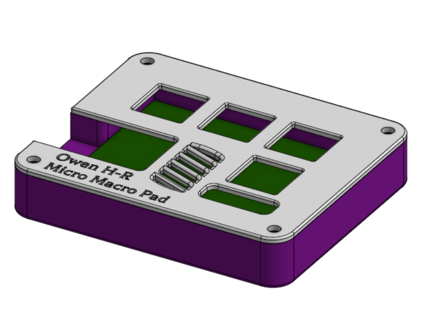
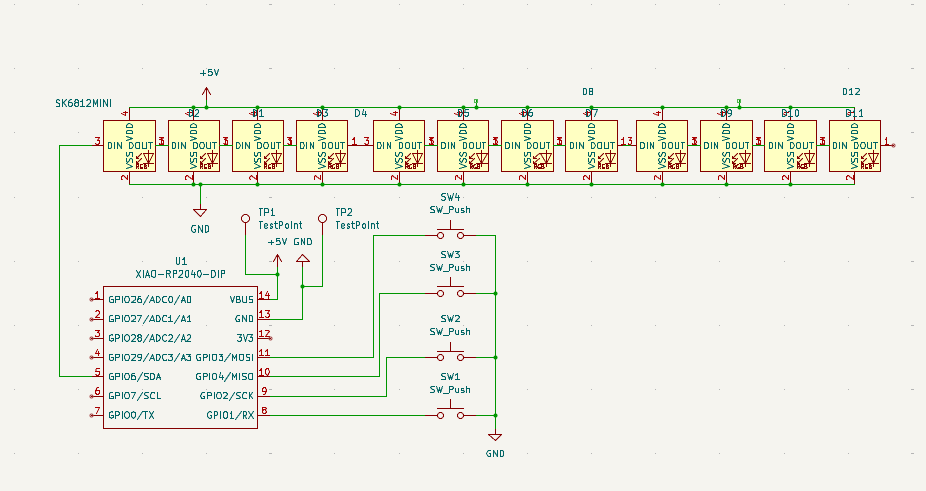

# HackPad-MicroMacro
Blueprint project of a hackpad to be used with my computer for gaming, coding and audio work.

Simple but versatile hackpad

Didn't want to learn fusion so I used Onshape but I did learn KiCAD which was fun

For now buttons are just for volume and copy/paste
Eventually I want to add midi functionality to work as a controller for a dm7 sound board
- This would allow me to make a "go" button that reacts with LEDs for theatrical sound

I also want to add light up functionality for things like caps lock and animations but for now I wanted less distractions from the main design

BOM:
- 4x Cherry MX Switches
- 12x SK6812 MINI LEDs
- 1x XIAO RP2040
- 4x Blank DSA Keycaps (White)
- 4x M3x16 Bolts
- 4x M3 Heatset Inserts
- 1x Printed Base
- 1x Printed Lid

CAD: done in onshape

Schematic: KiCAD

PCB: KiCAD

